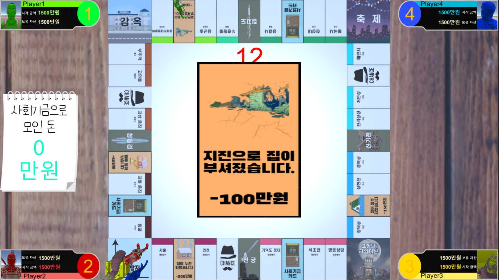

# monopoly

|제목|내용|
|:---:|:---:|
|기간|2021.11.04 ~ 2021.11.15|
|인원|4|
|역할|모든 로직, UI제작, 카드 초안 제작|
|주제|한국의 역사에 대해 공부할 수 있는 모노폴리|
|특이사항|대학교 경진대회 출품작 (우수상)|

## 인트로

## 플레이
### 기본 조작법

### 건축물 구매

#### 건축물 종류 (권리증)

### 무기 구매

#### 무기 종류 (권리증)

### 재난

#### 재난 종류

### 찬스 카드

#### 찬스 카드 종류

### 사회 기금
#### 15%의 확률로 당첨될 시, 사회기금에 있는 돈을 모두 획득
#### 낙첨될 시, 사회기금에 100만원 기부

### 시작지점
#### 지나치거나, 도착 시에 월급 500만원 획득

### 감옥
#### 아무일도 일어나지 않는다..

### 축제
#### 랜덤한 내 땅의 요금이 2배 증가 (구현 실패)

### 고장난 타임머신
#### 랜덤한 위치로 이동

## 승리조건
### 다른 플레이어를 파산시켜 마지막까지 살아남으면 승리!
### 역사적 4신기를 모두 모으면 게임 승리

 ※ 첫 유니티 작품이라 스크립트가 다소 난잡할 수 있습니다. 
